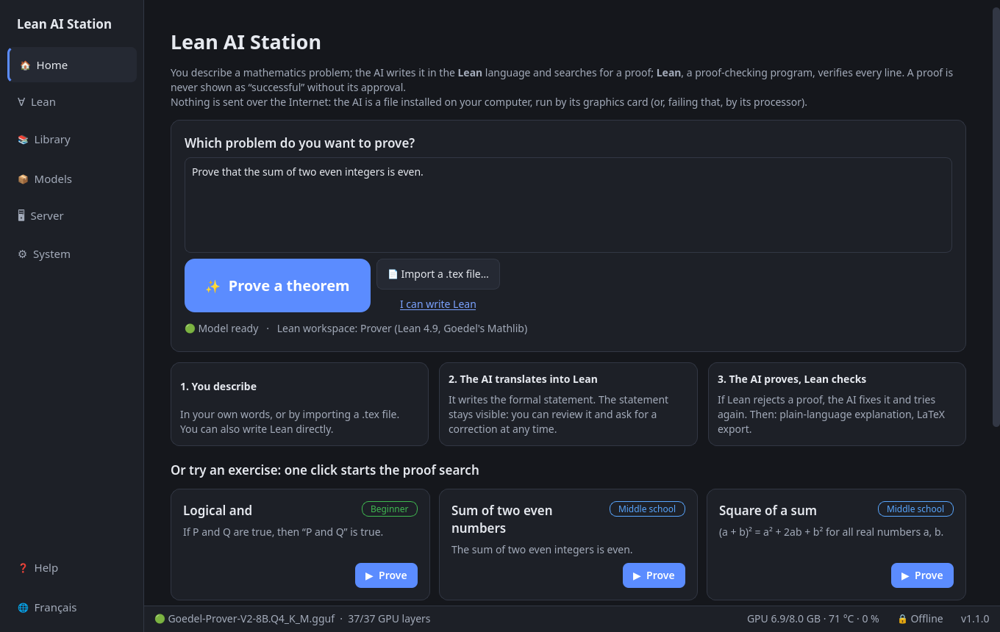
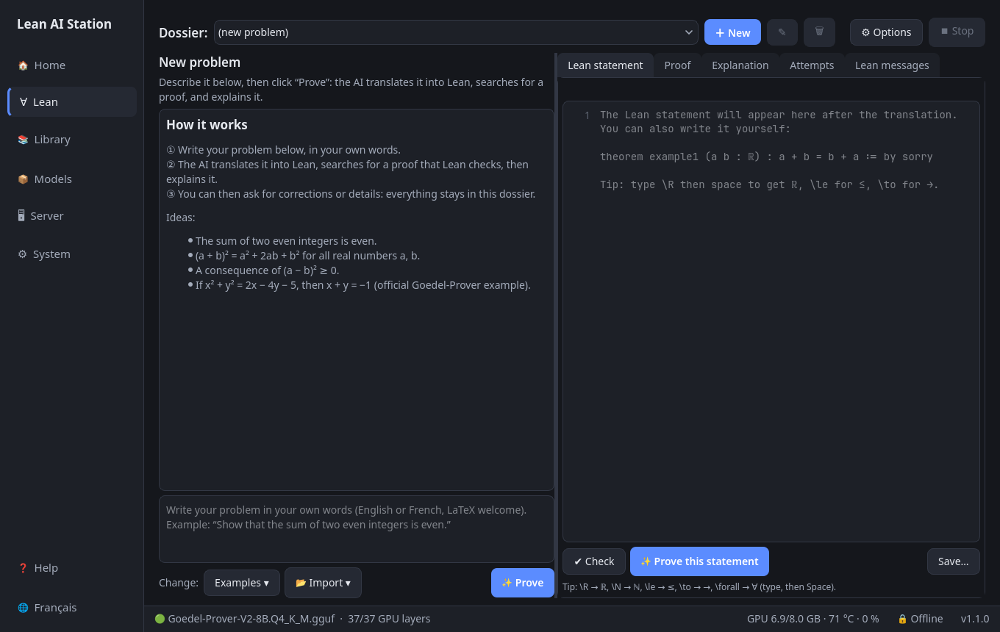

# Lean AI Station

*[Version française](README.md)*

**Describe a mathematics problem in your own words. An AI writes it in Lean, searches for a proof, Lean checks it,
and another AI explains it in plain language.**



## What is it for?

* **Lean** is a program that checks mathematical proofs line by line. When Lean says “correct”, the proof is correct.
  But statements and proofs must be written in a very precise language that takes months to learn.
* **This tool hands the writing to three specialised AI models** and has Lean check the result. A proof is only shown
  as successful when Lean accepts it, with no `sorry` (Lean's word for “unfinished”) and no extra axiom.
* **Nothing is sent over the Internet.** No account, no subscription, no online service: the models are files of about
  5 GB run by **your computer's NVIDIA graphics card** (or its processor, more slowly). Internet is only needed to install
  the tool and, once a week if you let it, to look for updates.
* **No Lean knowledge needed.** The **“❓ Help”** button explains Lean in two minutes.

## How to use it

1. **Describe your problem** in English or French (LaTeX formulas such as `$a^2+b^2\ge 2ab$` are welcome), or **import a
   `.tex` file**, then click **“✨ Prove a theorem”**.
2. **Everything runs on its own**: one AI first rewrites your request as a precise mathematical statement (for example
   “incomplete basis theorem” → “every linearly independent family extends to a basis”), another translates it into a Lean statement (Lean checks it is valid),
   another searches for a proof (when Lean rejects it, it reads the error and fixes it), a third one explains it in plain
   language. The right model is loaded automatically for each step.
3. **Read the Lean statement** shown in the thread: Lean proves exactly that text, not necessarily what you meant.
4. **Continue the conversation**: “add the hypothesis n > 0”, “a shorter proof”, “explain step 2”. The tool works out
   which step to redo (you can choose it), and keeps every version (“Go back to this version”). Each problem is a
   **dossier** you can reopen later.
5. Export: copy, `.lean` file, or a **LaTeX** document for Overleaf (statement, Lean version, explanation, proof).



**The assistant's memory**
* **Your profile** (System tab): audience, level, notations. Read before every translation and explanation.
* **The dossier thread**: every correction builds on the previous versions.
* **The library** (📚 tab): every proven result is stored and offered as a lemma for later proofs.

**Language**: the 🌐 button in the left bar (or the System tab) switches the interface and the explanations between
English and French.

### The three AI models (only one in graphics memory at a time)

| Task | Model | Why |
|---|---|---|
| Write and fix proofs | Goedel-Prover-V2-8B | specialised in Lean proofs |
| Translate a problem into a Lean statement | Goedel-Formalizer-V2-8B | same team, built for this task |
| Explain a proof in plain language | Qwen3-8B | general model: the prover answered in English and rewrote Lean |

## Install

Tested end to end on **EndeavourOS/Arch** with an NVIDIA RTX 4060 (8 GB of graphics memory). The installer is also tested
(fresh clone, CPU engine, start-up and tests) in **Fedora 44, Ubuntu 24.04 and Ubuntu 22.04** containers, and written for
**Debian and openSUSE** (not tested). Plan for ≈ 40 GB of disk space.

```bash
git clone https://github.com/raantss18/lean-ai-station.git ~/lean-ai-station
cd ~/lean-ai-station
./install.sh --install-deps        # --install-deps: installs the build tools with sudo (once)
```

**Install yourself first** (the script never touches drivers): the **NVIDIA driver** and the **CUDA Toolkit** (`nvcc`),
unless you choose `--backend cpu`. See the table in the [French README](README.md#installer) for each distribution.

`install.sh` (safe to run again) detects your distribution, installs the Lean manager *elan*, builds the *llama.cpp*
engine for your card (pinned version), sets up Python and the interface, downloads the three models (≈ 5 GB each,
SHA-256 checked), prepares the two Lean workspaces and adds **“Lean AI Station” to the applications menu**. The
“Prover” workspace builds Mathlib from source (≈ 1.5 h of computation, once). Options: `./install.sh --help`.

Launch: applications menu → **Lean AI Station** (or `~/lean-ai-station/bin/lean-ai-station`). On first launch an
assistant checks everything and runs a one-minute self-test.

**Updates** (System tab): every week the tool checks for a new Lean/Mathlib or Goedel model version (it only contacts
GitHub and Hugging Face; can be turned off). If there is one, a notification appears and one click on **“Install”** is
enough: the new version is installed next to the old one, verified, then the old one is deleted automatically. A Lean
version still used by one of your projects is kept; if anything fails, nothing changes. From a terminal:
`.venv/bin/python scripts/updater.py check`.

Offline copy to another computer: `./export_offline.sh /path/to/usb` then `bash /path/to/usb/import_offline.sh`.
Uninstall: `./uninstall.sh` (lists exactly what will be deleted).

## Known limits

* The 8-billion-parameter models do well on high-school and undergraduate exercises; olympiad problems often fail.
  “No proof found” does not mean the statement is false.
* A translation can change the meaning of a statement while remaining valid for Lean: **always read it**.
* The explanation is written by an AI; the Lean proof is the verified part.
* **Without an NVIDIA card everything works, but slowly** (≈ 5 tokens/s instead of ≈ 44 on the RTX 4060). AMD/Intel
  cards are not used yet.
* Measurements, design decisions and acceptance evidence: `BENCH.md`, `DECISIONS.md`, `ACCEPTANCE.md` (in English).

## For developers

* Tests: `./run_tests.sh` (fast) or `./run_tests.sh --all` (with models, Lean and GPU: several minutes).
* Code: `app/lean_ai_station/` (PySide6). Translations: `i18n_en.py`, checked by `tests/test_i18n.py`.
* No telemetry. Offline mode (on by default) blocks every non-local connection from the application, except the
  weekly update check (can be turned off in System).

## License

Apache-2.0, like Lean 4 (see `LICENSE` and `NOTICE` for third-party components). Models and Mathlib are not included
in this repository: `install.sh` downloads them.
