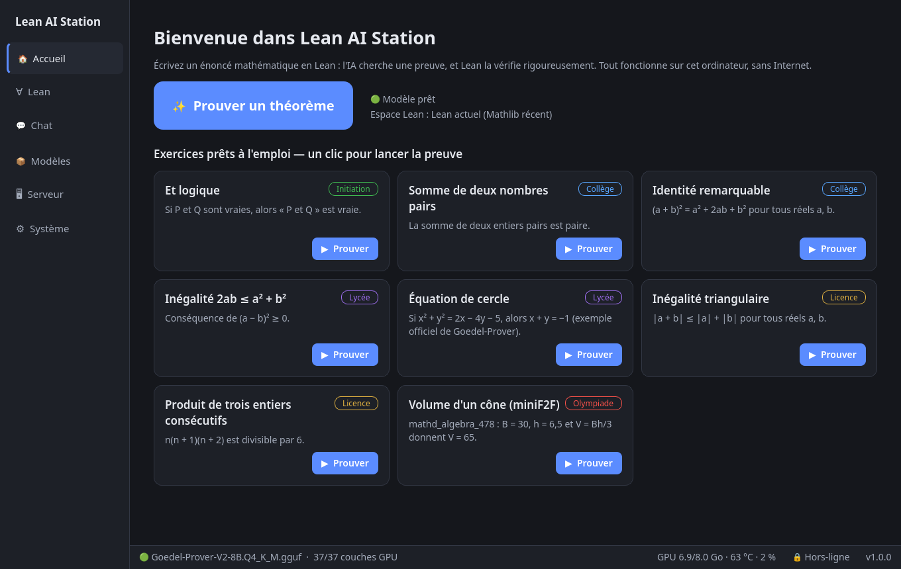
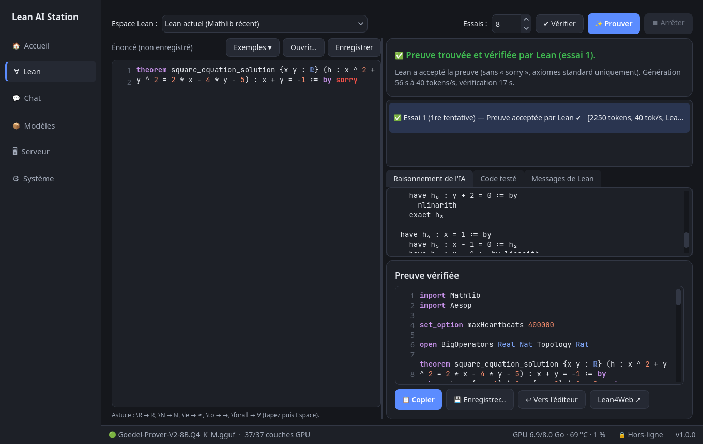

# Lean AI Station

Assistant de preuves **Lean 4** qui fonctionne **entièrement sur cet ordinateur** (hors-ligne) :
une IA spécialisée (**Goedel-Prover-V2-8B**) écrit une preuve, **Lean la vérifie**, et l'IA corrige
ses erreurs jusqu'à réussir. Une preuve n'est acceptée que si Lean l'accepte **sans `sorry`/`admit`**
et sans axiome non standard, pour l'énoncé exact que vous avez écrit.



## Installer (reproductible)

Testé sur EndeavourOS/Arch, NVIDIA RTX 4060 8 Go (CUDA 13.4). Installation **sans `sudo`** une fois les prérequis présents :

```bash
sudo pacman -S --needed nvidia-utils cuda base-devel cmake git python pyside6 zstd util-linux curl
git clone https://github.com/raantss18/lean-ai-station.git ~/lean-ai-station
cd ~/lean-ai-station && ./install.sh
```

`install.sh` (idempotent, relançable) : installe elan si absent, compile llama.cpp (commit épinglé) pour votre GPU,
crée l'environnement Python, télécharge le modèle Goedel-Prover-V2-8B Q4_K_M (≈ 5 Go, SHA-256 vérifié), prépare les
deux espaces Lean (Mathlib v4.34.1 via le cache, puis Mathlib de Goedel compilé depuis les sources : ≈ 1,5 h de CPU)
et ajoute le raccourci au menu. Il faut Internet une seule fois ; ensuite tout fonctionne hors-ligne.
Options : `--q5` (ajoute Q5_K_M), `--no-prover49`, `--no-current`.

## Lancer

Menu des applications → **Lean AI Station** (ou `~/lean-ai-station/bin/lean-ai-station`, ou glisser un fichier `.lean`
sur la fenêtre). Au premier lancement, un assistant vérifie tout et fait un auto-test (≈ 1 minute). Aucun réglage à faire.

## Utiliser

| Je veux… | Je fais… |
|---|---|
| Voir l'IA prouver un exercice | Accueil → **▶ Prouver** sous un exercice (1 clic) |
| Prouver mon propre énoncé | Onglet **Lean** → j'écris `theorem … := by sorry` → **✨ Prouver** |
| Vérifier mon fichier `.lean` | Je le **glisse sur la fenêtre** (ou Lean → **Ouvrir…**) : la vérification démarre seule |
| Changer de modèle | **Modèles** → double-clic sur le modèle |
| Relancer l'IA après un problème | Cliquer **Redémarrer le modèle** dans le message en haut |

Astuces de saisie : `\R` + Espace → ℝ, `\N` → ℕ, `\le` → ≤, `\to` → →, `\forall` → ∀, `\exists` → ∃.
Raccourcis : Ctrl+1…6 (onglets), Ctrl+Entrée (vérifier), Ctrl+Maj+Entrée (prouver), Échap (arrêter).



## Espaces Lean

* **Prouveur (Lean 4.9, Mathlib de Goedel)** — la version exacte utilisée pour entraîner le modèle : meilleurs résultats.
* **Lean actuel (Mathlib récent)** — pour les cours et le travail quotidien.
* Vos projets existants (lean4web, cours…) sont détectés et utilisés **en lecture seule** (jamais modifiés).

## Ce qui a été installé

Voir `AUDIT.md` (état initial), `DECISIONS.md` (choix justifiés), `BENCH.md` (mesures), `ACCEPTANCE.md` (preuves de bon fonctionnement).
Aucune modification système (pas de `sudo`). Désinstallation : `./uninstall.sh` (liste exactement ce qui sera supprimé).
Copie vers un autre ordinateur hors-ligne : `./export_offline.sh /chemin/vers/clé`.

## Pour les curieux / développeurs

* Tests : `./run_tests.sh` (rapides) ou `./run_tests.sh --all` (avec modèle et Lean, plusieurs minutes).
* Code : `app/lean_ai_station/` (PySide6). Moteur : llama.cpp compilé pour CUDA (RTX 4060, sm_89).
* Aucune télémétrie. Le mode hors-ligne (activé par défaut) bloque toute connexion non locale dans l'application.

## Licence

Apache-2.0, comme Lean 4 (voir `LICENSE` et `NOTICE` pour les composants tiers : Goedel-Prover-V2, miniF2F, llama.cpp).
Le modèle et Mathlib ne sont pas inclus dans ce dépôt : ils sont téléchargés par `install.sh`.
