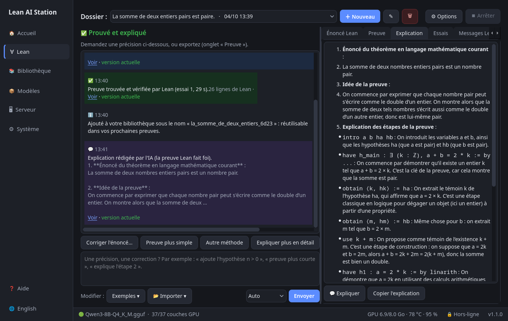
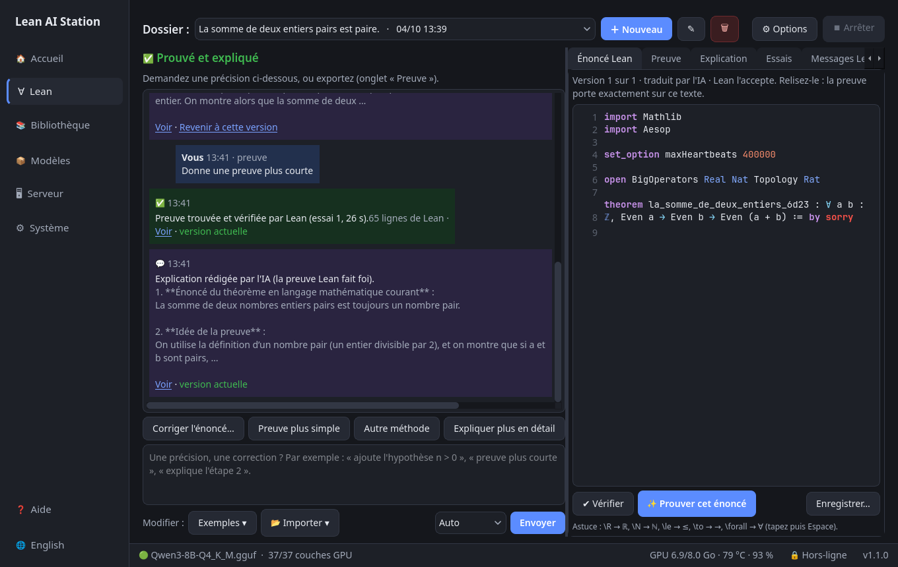
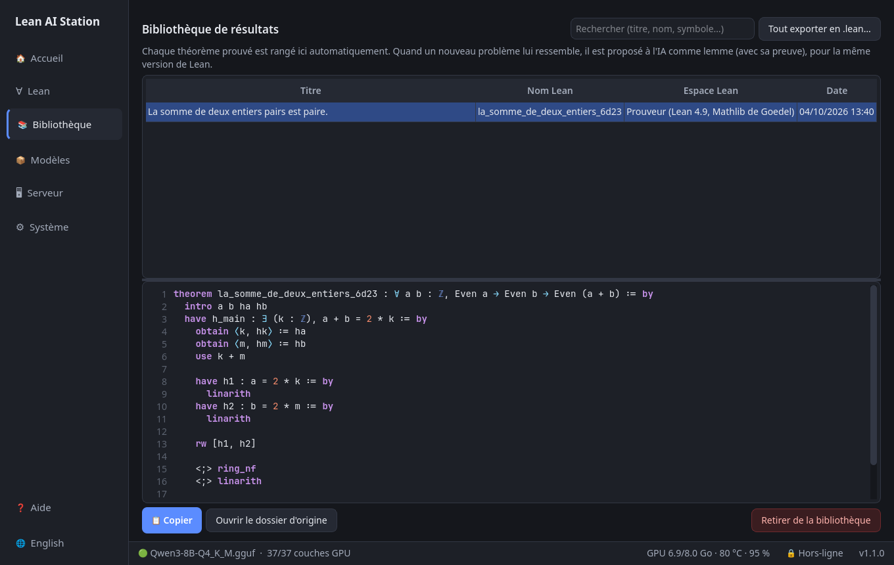

# Lean AI Station

*[English version](README.en.md)*

**Vous décrivez un problème de mathématiques avec vos mots. Une IA l'écrit en Lean, cherche une preuve, et Lean la vérifie.**


## À quoi ça sert, concrètement ?

* **Lean** est un logiciel qui vérifie des preuves mathématiques ligne par ligne. Quand Lean dit « correct », la preuve
  est correcte — c'est sa seule raison d'être. Mais il faut lui écrire les énoncés et les preuves dans un langage
  très précis, ce qui demande des mois d'apprentissage.
* **Cet outil confie l'écriture à une IA** (le modèle *Goedel-Prover*), puis fait vérifier le résultat par Lean.
  L'IA peut se tromper ; Lean, lui, tranche. Une preuve n'est affichée comme réussie que si Lean l'a acceptée,
  sans `sorry` (le mot Lean pour « preuve à compléter ») et sans axiome supplémentaire.
* **Rien n'est envoyé sur Internet.** Il n'y a ni compte, ni abonnement, ni service en ligne : l'IA est un fichier
  d'environ 5 Go exécuté directement par la **carte graphique NVIDIA de votre ordinateur**. Internet n'est utile que pour
  installer l'outil et, une fois par semaine si vous le laissez faire, pour savoir s'il existe une mise à jour.
* **Pas besoin de connaître Lean.** Un bouton **« ❓ Aide »** explique en deux minutes ce qu'est Lean, à quoi ressemble
  un énoncé et pourquoi il faut relire la traduction.

## Comment l'utiliser

1. **Décrivez votre problème** en français ou en anglais (formules LaTeX acceptées, comme `$a^2+b^2\ge 2ab$`), ou
   **importez un fichier `.tex`**, puis cliquez sur **« ✨ Prouver un théorème »**.
2. **Tout s'enchaîne seul** : une IA reformule d'abord votre demande en énoncé mathématique précis (par exemple
   « théorème de la base incomplète » → « toute famille libre se complète en une base »), une autre le traduit en énoncé Lean (Lean vérifie qu'il est valide), une autre
   cherche une preuve (si Lean la refuse, elle lit l'erreur et corrige), une troisième l'explique en langage courant.
   Le bon modèle est chargé automatiquement à chaque étape.
3. **Relisez l'énoncé Lean** affiché dans le fil : Lean prouve exactement ce texte, pas forcément ce que vous aviez en tête.
4. **Continuez la discussion** : « ajoute l'hypothèse n > 0 », « une preuve plus courte », « explique l'étape 2 ».
   L'outil devine quelle étape refaire (vous pouvez la choisir), et garde toutes les versions (« Revenir à cette version »).
   Chaque problème est un **dossier** que vous retrouvez plus tard.
5. Exportez : copie, fichier `.lean`, ou document **LaTeX** pour Overleaf (énoncé, version Lean, explication, preuve).




**Mémoire de l'assistant**
* **Votre profil** (onglet Système) : public, niveau, notations. Lu avant chaque traduction et chaque explication.
* **Le fil du dossier** : chaque correction s'appuie sur les versions précédentes.
* **La bibliothèque** (onglet 📚) : chaque résultat prouvé y est rangé et proposé comme lemme pour les preuves suivantes.



**Langue** : bouton 🌐 dans la barre de gauche (ou onglet Système) pour passer l'interface et les explications en anglais.

Autres usages : glisser un fichier `.lean` ou `.tex` sur la fenêtre ; **✔ Vérifier** (F5) contrôle un fichier Lean écrit
à la main ; **💬 Expliquer** marche aussi sur une preuve collée dans l'onglet « Énoncé Lean ».

### LaTeX et Overleaf

* **Entrée** : « 📄 Importer un .tex » (ou glisser le fichier). Si le document contient plusieurs énoncés, vous choisissez lequel.
* **Sortie** : après une preuve réussie, **« 📄 LaTeX ▾ »** enregistre un `.tex` (compilé avec XeLaTeX), copie le code
  ou ouvre votre Overleaf. Dans Overleaf : *Nouveau projet → Téléverser* (ou collez le code dans un fichier), puis
  choisissez le compilateur **XeLaTeX**. L'adresse de votre Overleaf se règle dans l'onglet *Système*.
* L'outil ne se connecte pas lui-même à Overleaf : il n'a pas votre mot de passe et ne demande jamais de l'entrer.

### Les trois IA (une seule en mémoire à la fois)

| Tâche | Modèle | Pourquoi ce modèle |
|---|---|---|
| Écrire et corriger les preuves | Goedel-Prover-V2-8B | spécialisé en preuves Lean |
| Traduire un problème en énoncé Lean | Goedel-Formalizer-V2-8B | même équipe, conçu pour cette tâche |
| Expliquer une preuve en français | Qwen3-8B | modèle généraliste : le prouveur répondait en anglais et recopiait du Lean |

## Installer

Testé de bout en bout sur **EndeavourOS/Arch** avec une NVIDIA RTX 4060 (8 Go de mémoire graphique). Le script d'installation
est aussi testé (installation à partir d'un clone neuf, moteur processeur, démarrage et tests) dans des conteneurs
**Fedora 44, Ubuntu 24.04 et Ubuntu 22.04**, et prévu pour **Debian et openSUSE** (non testés), avec une carte NVIDIA (≥ 8 Go conseillés) ou, **sans carte graphique**,
sur le processeur seul (fonctionne, mais beaucoup plus lent). Prévoyez ≈ 40 Go de disque.

```bash
git clone https://github.com/raantss18/lean-ai-station.git ~/lean-ai-station
cd ~/lean-ai-station
./install.sh --install-deps        # --install-deps : installe les outils de compilation avec sudo (une fois)
```

**À installer vous-même avant** (le script ne touche jamais aux pilotes) : le **pilote NVIDIA** et le **CUDA Toolkit**
(`nvcc`), sauf si vous choisissez `--backend cpu`.

| Distribution | Pilote + CUDA |
|---|---|
| Arch / EndeavourOS | `sudo pacman -S nvidia-open nvidia-utils cuda` |
| Fedora | pilote via RPM Fusion (`akmod-nvidia xorg-x11-drv-nvidia-cuda`), CUDA via le dépôt NVIDIA : <https://developer.nvidia.com/cuda-downloads> |
| Debian / Ubuntu | `sudo apt install nvidia-driver-XXX nvidia-cuda-toolkit` (ou le dépôt NVIDIA) |
| openSUSE | dépôt NVIDIA : <https://developer.nvidia.com/cuda-downloads> |

`install.sh` (relançable sans risque) détecte votre distribution, installe le gestionnaire Lean *elan*, compile le moteur d'IA
*llama.cpp* pour votre carte (version épinglée), prépare Python et l'interface, télécharge les trois modèles
(≈ 5 Go chacun, empreintes SHA-256 vérifiées), prépare les deux espaces Lean et ajoute **« Lean AI Station » au menu des
applications**. L'espace « Prouveur » compile Mathlib depuis les sources (≈ 1 h 30 de calcul, une seule fois).
Options : `--backend cuda|cpu`, `--no-models`, `--no-translator`, `--no-explainer`, `--no-prover49`, `--no-current`, `--q5`
(`./install.sh --help`).

Lancement : menu des applications → **Lean AI Station** (ou `~/lean-ai-station/bin/lean-ai-station`).
Au premier lancement, un assistant vérifie tout et fait un auto-test d'environ une minute.

**Mises à jour** (onglet Système) : chaque semaine, l'outil regarde s'il existe une nouvelle version de Lean/Mathlib ou
des modèles Goedel (il ne contacte que GitHub et Hugging Face ; désactivable). Si oui, une notification s'affiche et un
clic sur **« Installer »** suffit : la nouvelle version est installée à côté de l'ancienne, vérifiée, puis l'ancienne est
supprimée automatiquement. Une version de Lean encore utilisée par un de vos projets est conservée ; en cas d'échec, rien
ne change. En terminal : `.venv/bin/python scripts/updater.py check`.

Copie vers un ordinateur sans Internet : `./export_offline.sh /chemin/clé` puis, sur l'autre machine, `bash /chemin/clé/import_offline.sh`.
Désinstallation : `./uninstall.sh` (liste exactement ce qui sera supprimé).

## Limites à connaître

* Le modèle (8 milliards de paramètres) réussit bien les exercices de lycée et de licence ; les problèmes d'olympiade
  échouent souvent. « Pas de preuve trouvée » ne signifie pas que l'énoncé est faux.
* La traduction français → Lean peut changer le sens d'un énoncé tout en restant valide pour Lean : **relisez-la toujours**.
* Les modèles de 5 Go ne tiennent pas ensemble dans 8 Go de mémoire graphique : l'outil les charge à tour de rôle
  (quelques secondes à chaque changement).
* **Sans carte NVIDIA, tout fonctionne mais lentement** : mesuré sur un Ryzen 7 (8 threads), ≈ 5 tokens/s en écriture contre ≈ 44 sur la RTX 4060 (et ≈ 15 contre ≈ 1 800 pour la lecture de la question) ; une preuve peut alors prendre de plusieurs minutes à plusieurs dizaines de minutes. Les cartes AMD/Intel ne sont pas utilisées pour l'instant.
* Mesures, choix techniques et preuves de bon fonctionnement : `BENCH.md`, `DECISIONS.md`, `ACCEPTANCE.md`.

## Pour les développeurs

* Tests : `./run_tests.sh` (rapides) ou `./run_tests.sh --all` (avec modèles, Lean et GPU : plusieurs minutes).
* Code : `app/lean_ai_station/` (PySide6). Moteur : llama.cpp compilé pour CUDA ; vérification : `lean --json`, sans `lake`.
* Aucune télémétrie. Le mode hors-ligne (activé par défaut) bloque toute connexion non locale de l'application, sauf
  la vérification hebdomadaire des mises à jour (désactivable dans Système).

## Licence

Apache-2.0, comme Lean 4 (voir `LICENSE` et `NOTICE` pour les composants tiers : Goedel-Prover-V2, miniF2F, llama.cpp).
Les modèles et Mathlib ne sont pas inclus dans ce dépôt : ils sont téléchargés par `install.sh`.
