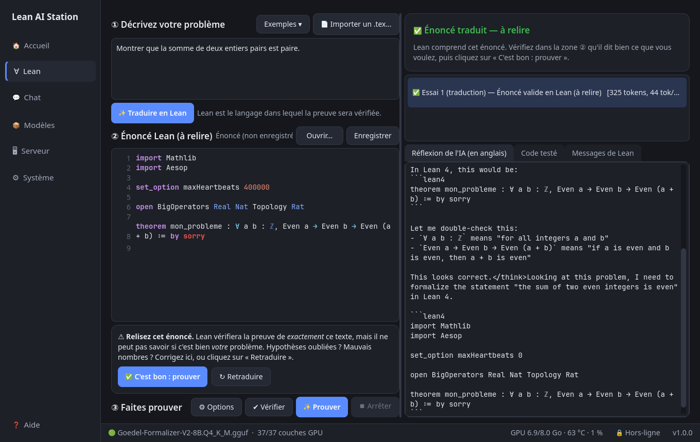
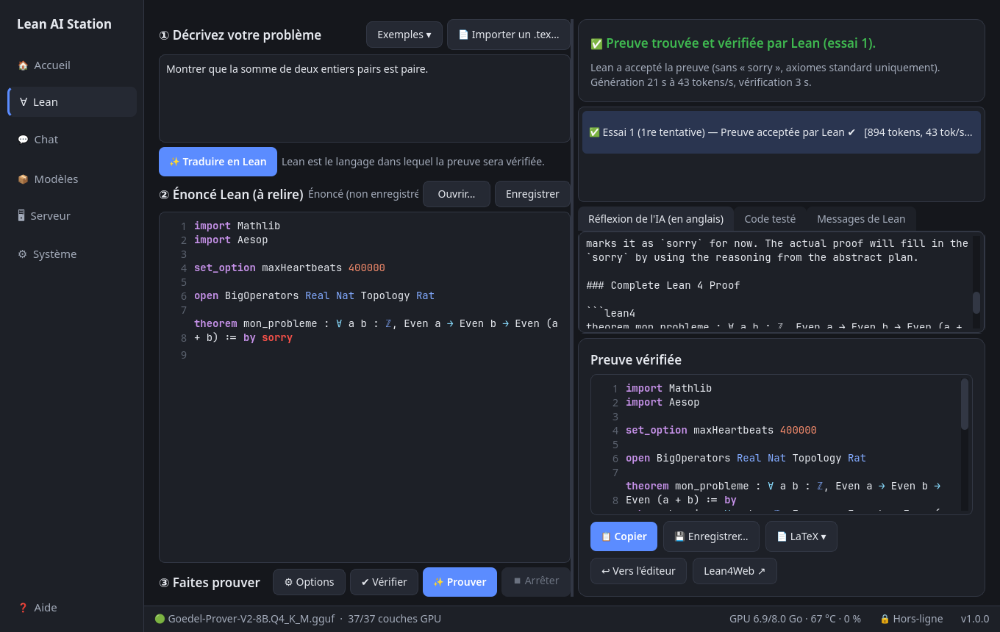

# Lean AI Station

**Vous décrivez un problème de mathématiques avec vos mots. Une IA l'écrit en Lean, cherche une preuve, et Lean la vérifie.**


## À quoi ça sert, concrètement ?

* **Lean** est un logiciel qui vérifie des preuves mathématiques ligne par ligne. Quand Lean dit « correct », la preuve
  est correcte — c'est sa seule raison d'être. Mais il faut lui écrire les énoncés et les preuves dans un langage
  très précis, ce qui demande des mois d'apprentissage.
* **Cet outil confie l'écriture à une IA** (le modèle *Goedel-Prover*), puis fait vérifier le résultat par Lean.
  L'IA peut se tromper ; Lean, lui, tranche. Une preuve n'est affichée comme réussie que si Lean l'a acceptée,
  sans `sorry` (le mot Lean pour « preuve à compléter ») et sans axiome supplémentaire.
* **Rien n'est envoyé sur Internet.** Il n'y a ni compte, ni abonnement, ni service en ligne : l'IA est un fichier
  d'environ 5 Go exécuté directement par la **carte graphique NVIDIA de votre ordinateur**. Internet n'est utile qu'une
  seule fois, pour installer l'outil.
* **Pas besoin de connaître Lean.** Un bouton **« ❓ Aide »** explique en deux minutes ce qu'est Lean, à quoi ressemble
  un énoncé et pourquoi il faut relire la traduction.

## Comment l'utiliser

1. **Décrivez votre problème** en français ou en anglais (les formules LaTeX comme `$a^2+b^2\ge 2ab$` sont acceptées),
   ou **importez un fichier `.tex`** : l'outil en extrait vos théorèmes, lemmes ou exercices.
2. Cliquez sur **« ✨ Prouver un théorème »** : l'IA traduit votre texte en énoncé Lean et Lean vérifie qu'il est valide.
   **Relisez l'énoncé** (hypothèses, nombres, conclusion) : Lean prouvera exactement ce texte, pas forcément ce que
   vous aviez en tête.
3. Cliquez sur **« ✅ C'est bon : prouver »**. L'IA écrit une preuve ; si Lean la refuse, elle lit l'erreur, corrige et
   réessaie. Chaque essai est visible.
4. Récupérez le résultat : **copier**, **enregistrer** en `.lean`, ou **exporter en LaTeX** (document prêt pour Overleaf
   avec votre énoncé, sa version Lean et la preuve vérifiée).




Autres façons de s'en servir : glisser un fichier `.lean` ou `.tex` sur la fenêtre ; le bouton **✔ Vérifier** contrôle
un fichier Lean que vous avez écrit ; l'onglet **Chat** permet de discuter avec le modèle.

### LaTeX et Overleaf

* **Entrée** : « 📄 Importer un .tex » (ou glisser le fichier). Si le document contient plusieurs énoncés, vous choisissez lequel.
* **Sortie** : après une preuve réussie, **« 📄 LaTeX ▾ »** enregistre un `.tex` (compilé avec XeLaTeX), copie le code
  ou ouvre votre Overleaf. Dans Overleaf : *Nouveau projet → Téléverser* (ou collez le code dans un fichier), puis
  choisissez le compilateur **XeLaTeX**. L'adresse de votre Overleaf se règle dans l'onglet *Système*.
* L'outil ne se connecte pas lui-même à Overleaf : il n'a pas votre mot de passe et ne demande jamais de l'entrer.

## Installer

Testé sur EndeavourOS / Arch Linux avec une NVIDIA RTX 4060 (8 Go de mémoire graphique). Il faut une carte NVIDIA
d'au moins 8 Go et environ 40 Go d'espace disque. L'installation ne demande **pas** `sudo` une fois les prérequis présents :

```bash
sudo pacman -S --needed nvidia-utils cuda base-devel cmake git python pyside6 zstd util-linux curl
git clone https://github.com/raantss18/lean-ai-station.git ~/lean-ai-station
cd ~/lean-ai-station && ./install.sh
```

`install.sh` (relançable sans risque) installe le gestionnaire Lean *elan* si besoin, compile le moteur d'IA *llama.cpp* pour
votre carte graphique, télécharge les deux modèles (prouveur et traducteur, ≈ 5 Go chacun, empreintes SHA-256 vérifiées),
prépare les deux espaces Lean et ajoute **« Lean AI Station » au menu des applications**. L'espace « Prouveur » compile
Mathlib depuis les sources (≈ 1 h 30 de calcul, une seule fois). Options : `--q5`, `--no-prover49`, `--no-current`.

Lancement : menu des applications → **Lean AI Station** (ou `~/lean-ai-station/bin/lean-ai-station`).
Au premier lancement, un assistant vérifie tout et fait un auto-test d'environ une minute.

Copie vers un ordinateur sans Internet : `./export_offline.sh /chemin/clé` puis, sur l'autre machine, `bash /chemin/clé/import_offline.sh`.
Désinstallation : `./uninstall.sh` (liste exactement ce qui sera supprimé).

## Limites à connaître

* Le modèle (8 milliards de paramètres) réussit bien les exercices de lycée et de licence ; les problèmes d'olympiade
  échouent souvent. « Pas de preuve trouvée » ne signifie pas que l'énoncé est faux.
* La traduction français → Lean peut changer le sens d'un énoncé tout en restant valide pour Lean : **relisez-la toujours**.
* Deux modèles de 5 Go ne tiennent pas ensemble dans 8 Go de mémoire graphique : l'outil les charge à tour de rôle
  (quelques secondes à chaque changement).
* Mesures, choix techniques et preuves de bon fonctionnement : `BENCH.md`, `DECISIONS.md`, `ACCEPTANCE.md`.

## Pour les développeurs

* Tests : `./run_tests.sh` (rapides) ou `./run_tests.sh --all` (avec modèles, Lean et GPU : plusieurs minutes).
* Code : `app/lean_ai_station/` (PySide6). Moteur : llama.cpp compilé pour CUDA ; vérification : `lean --json`, sans `lake`.
* Aucune télémétrie. Le mode hors-ligne (activé par défaut) bloque toute connexion non locale de l'application.

## Licence

Apache-2.0, comme Lean 4 (voir `LICENSE` et `NOTICE` pour les composants tiers : Goedel-Prover-V2, miniF2F, llama.cpp).
Les modèles et Mathlib ne sont pas inclus dans ce dépôt : ils sont téléchargés par `install.sh`.
